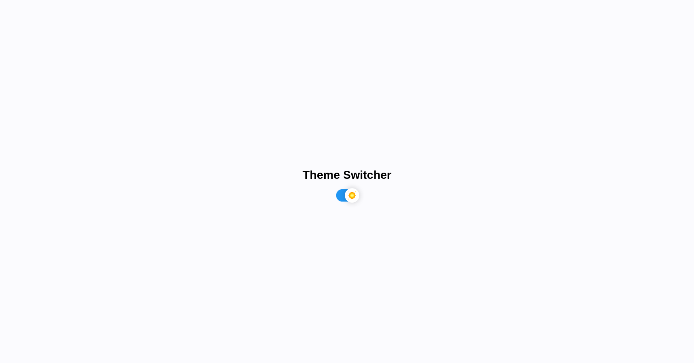
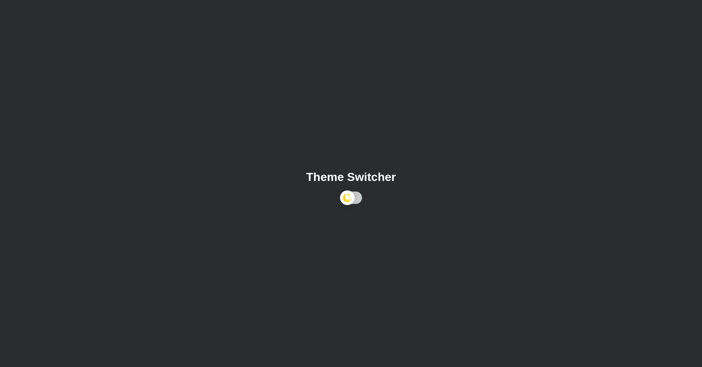

<h1 align="center">
  <a href="https://samucatezu.github.io/ThemeSwitcher/">Site do programa </a>
</h1>

<h1 align="center">
  Tela clara
</h1>

<h1 align="center" style="display: grid;">
  
</h1>

<h1 align="center" >
  Tela escura
</h1>

<h1 style="display: flex" align="center">
  
</h1>

 

## 🚀 Tecnologias
Projeto desenvolvido com as seguintes tecnologias:

- CSS
- HTML5
- JavaScript

<h1 align="center">
  <a href="https://medium.com/@haxzie/dark-and-light-theme-switcher-using-css-variables-and-pure-javascript-zocada-dd0059d72fa2"> Source</a>
</h1>

## 💻 Projeto

Um projeto simples para entender e obter mais conhecimento sobre JavaScript e suas funcionalidades. Nele, o user pode mudar o tema do site de forma simples e concisa
